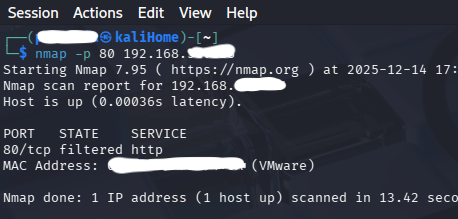
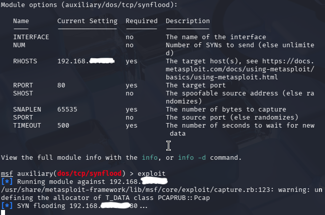
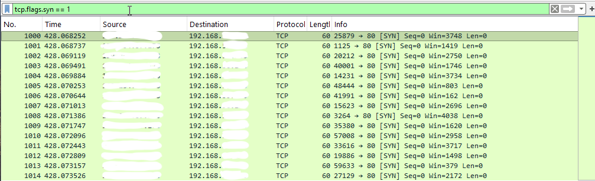
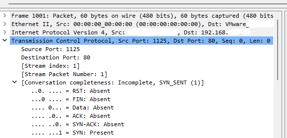

# SYN Flood Analysis Lab

## Overview
This lab simulates a SYN flood denial-of-service attempt against a Windows system to analyze network indicators, validate firewall configuration, and assess detection capabilities using packet capture tools.

## Environment
- Hypervisor: VMware
- Attacker VM: Kali Linux
- Target VM: Windows
- Network Type: Host-Only

## Tools Used
- Nmap
- Metasploit
- Wireshark

## Methodology

### Step 1: Firewall Configuration

- Create an inbound Windows Firewall rule allowing TCP port 80

- Verify the open port using Nmap

### Step 2: Launch Wireshark
- Start packet capture on the Windows VM using wireshark

### Step 3: Simulate an SYN Flood using Metasploit
- Initialized Metasploit on Kali Linux
- Configured a TCP SYN flood against port 80

### Step 4: Launch the Attack
use command `exploit` to start the synflood

## Network Traffic Analysis
Indicators observed:
- High volume of SYN packets
- Incomplete TCP handshakes
- Repeated traffic targeting port 80

## Detection & Findings
- SYN flood traffic was visible at the network level
- No service disruption occurred
- The attack failed due to system and environmental limitations

## Incident Response Perspective
Recommended mitigations:
- SYN cookies
- Rate limiting
- IDS/IPS deployment
- Firewall tuning

## Skills Demonstrated
- Network traffic analysis
- DoS detection
- Firewall configuration
- Packet capture interpretation

⚠️ IP addresses have been redacted.  
This lab was conducted in a controlled environment for defensive testing.

